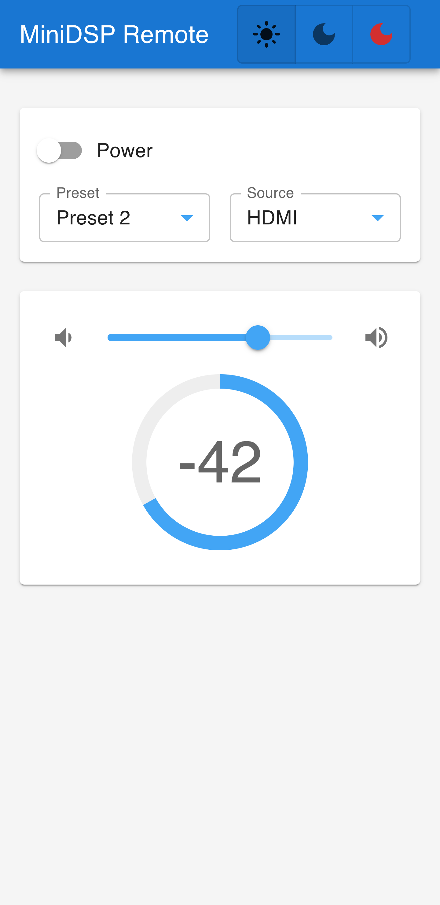

# Minidsp Remote

This is a remote control for the MiniDSP.  It is designed to be run on a Raspberry Pi.

## Client 

Client is programmed using ReactJS.

## Server

### MiniDSP version

Version 1.0 and up only supports `minidsp-rs` 1.10 and up. This version allows sources to be selected through the UI.

Versions lower than 1.0 support `minidsp-rs` 1.9.  Only volume control is supported for the MiniDSP.  

### How the server works

Server is a simple NodeJS server.  It makes call directly to the underlying binaries required for MiniDSP and uhubctl.  See https://minidsp-rs.pages.dev/cli/ and https://www.byfarthersteps.com/6802/.  

## Installing/running

Download the packaged static UI and server code `minidsp-ui.tar.gz` from `releases`.  Extract the tar.gz, and run `npm ci` to install the dependencies.  Run the server with `sudo USB_INDEX=[yourusbindex] node index` or `sudo USB_INDEX=[yourusbindex] npm start`.  The server has to run as root for `uhubctl` to access the USB ports.  It is recommended to run the server as a service.  See [examples/install_script.sh](./examples/install_script.sh) for an example of how to install server.  See [examples/minidsp-ui.service](./examples/minidsp-ui.service) for an example of how to run the server as a service.

## Bluetooth with VOL20

A Bluetooth interface for the [Fosi VOL20](https://fosiaudio.com/products/vol20-bluetooth-volume-control-knob) is also available.  It relies on [node-ble](https://github.com/chrvadala/node-ble) and [node-hid](https://github.com/node-hid/node-hid), so any limitations that exist in those libraries also exist for the Bluetooth Interface.  

From a terminal, run `bluetoothctl`.  Type `list` to view controllers.  Pick your preferred controller by typing `select [controlleraddress]`.  Then, with the Fosi volume control on, run `scan on`.  This will find nearby bluetooth devices.  The VOL20 should be found.  Once it is, type `scan off`.  Then type `devices` to confirm that the VOL20 is still showing up.  Type `connect [deviceaddress]` and it will connect and "pair" with the VOL20 device.  Exit the CLI tool by typing `exit` or `quit`.

Next, run the [bluetoothserver](./server/bt.js) as root.  It should show a list of bluetooth controller IDs.  This is different from the controller address.  By default, the server will select the first controller ID.  It will then print the address.  If you want a different controller, pass in the environment variable `BLUETOOTH_DEVICE_ID`.  For example, `sudo BLUETOOTH_DEVICE_ID=hci1 node server/bt.js`.

